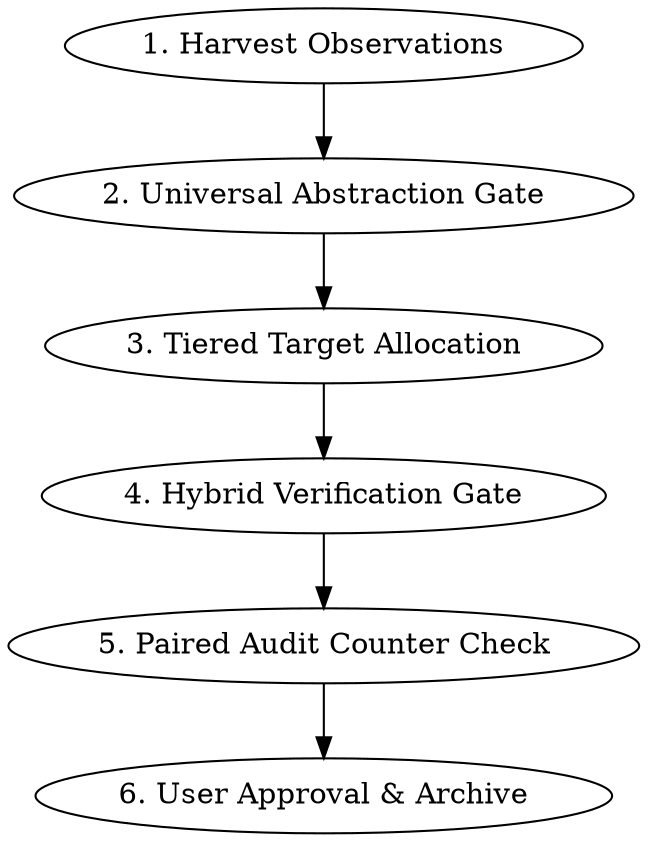

# Evolving Skills

Maintain the `superpowers` skill pack as versioned procedural memory. Evolve general engineering patterns from raw observation notes using Graph Engineering principles (paired counter-metrics, frozen anchors, and independent audit loops).

## Core Principles

1. **Strict Universal Abstraction**: Skills are general engineering patterns. Strip all project-specific names, paths, and repositories during distillation.
2. **Frozen Anchors**: Core Iron Laws (*"No skill without a failing test"*, *"Never violate path boundaries"*) CANNOT be edited or weakened.
3. **Tiered Progressive Disclosure**: `SKILL.md` stays ultra-lean (< 500 words). Niche errors, rare edge cases, and heavy reference guides belong in nested `references/` directories.

## Workflow

### 1. Harvest Observations
Run `python3 scripts/parse_observations.py --project-root "$PROJECT_ROOT" --list`
to fetch pending repository-local notes. Group observations by target skill.

When the user explicitly asks to evolve skills from another active repository,
also inspect that repository's significant notes under
`.superpowers/observations/`. Do not harvest this directory during routine
closeout, and do not copy project-specific paths, names, secrets, or raw
transcripts into the global library. Cross-repository edits require explicit
user approval.

Repositories only observe and propose. An explicit global evolution run alone
may generalize, test, approve, and release a global change. Neither a local
proposal nor a global release auto-writes another repository. See
`references/local-adapter-protocol.md` for details.

### 2. Universal Abstraction Gate
Convert raw observations into universal engineering patterns:
- Isolate the general symptom and verbatim rationalization.
- Classify rule form: Prohibition Table, Output Contract/Recipe, Structural Template, or Observable Conditional.

### 3. Tiered Target Allocation
- **`SKILL.md`**: Core triggers, < 500 words, high-priority Red Flags / Rationalization tables.
- **`references/`**: Topic guides or nested folders for niche/rare error modes.
- **`scripts/`**: Executable helper tools for repetitive operations.

### 4. Hybrid Verification Gate
- **Rule/Discipline Changes**: Perform TDD micro-tests (RED: verify agent fails/rationalizes without patch $\rightarrow$ GREEN: verify agent complies with patch).
- **Reference & Script Updates**: Run static audit (Abstraction Audit, dead link check, script execution test).

### 5. Paired Audit Counter-Metric Check & Archive
- **Token Budget Check**: Ensure `SKILL.md` word count remains < 500.
- **Frozen Anchor Check**: Ensure no core safety rule was weakened.
- Present candidate diff to user. Upon approval, apply edit and archive note:
  `python3 scripts/parse_observations.py --archive <filepath>`

## Red Flags

| Thought | Reality |
|---------|---------|
| "I'll include project details for context" | Superpowers MUST be 100% universal. Strip project context. |
| "I'll append this rule to SKILL.md" | Check token budget first! Use `references/` for progressive disclosure. |
| "I'll soften the Iron Law to fit this case" | Iron Laws are Frozen Anchors. Do NOT weaken them. |
